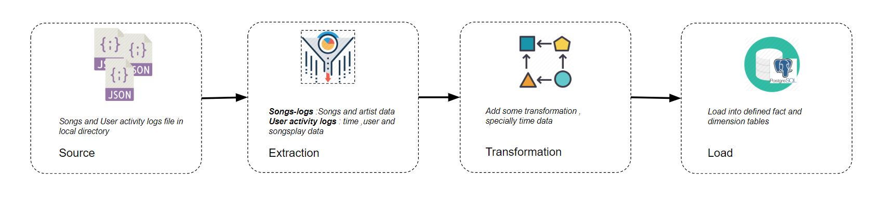
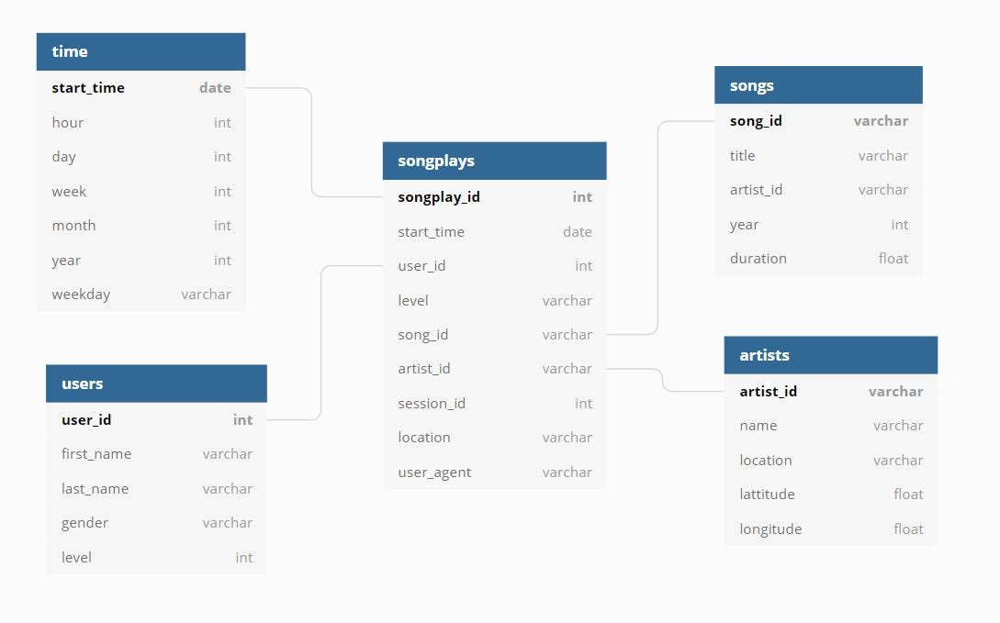

# Sparkify ETL Pipeline (Postgres)


## Overview

This is the first project submission for the Data Engineering Nanodegree. The following is expected to be covered by this course.
- Data modeling with PostgresSQL
- Creating database star schema and building fact and dimentions tables
- Error free ETL pipeline using Python

## Context 

A startup called Sparkify wants to analyze the data they've been collecting on songs and user activity on their new music streaming app. The analytics team is particularly interested in understanding what songs users are listening to. Currently, they don't have an easy way to query their data, which resides in a directory of JSON logs on user activity on the app, as well as a directory with JSON metadata on the songs in their app.

## Project Description

In this project, you'll apply what you've learned on data modeling with Postgres and build an ETL pipeline using Python.



To complete the project, you will need to define fact and dimension tables for a star schema for a particular analytic focus, and write an ETL pipeline that transfers data from files in two local directories into these tables in Postgres using Python and SQL.

### Data Set

There are two types of logs files, that we consider as our data sources. All logs files are in json format and files are loaded in local directory.

- **Song datasets**:
  All json files are nested in subdirectories under */data/song_data*. 
 A sample of this songs log files is:
 
```
{
  "num_songs": 1,
  "artist_id": "ARD7TVE1187B99BFB1",
  "artist_latitude": null,
  "artist_longitude": null,
  "artist_location": "California - LA",
  "artist_name": "Casual",
  "song_id": "SOMZWCG12A8C13C480",
  "title": "I Didn't Mean To",
  "duration": 218.93179,
  "year": 0
}
```
 
- **Log datasets**:
  All json files are nested in subdirectories under */data/log_data*. A sample of a single row of each files is:


```
{
  "artist": "Dance Gavin Dance",
  "auth": "Logged In",
  "firstName": "Marina",
  "gender": "F",
  "itemInSession": 0,
  "lastName": "Sutton",
  "length": 218.46159,
  "level": "free",
  "location": "Salinas, CA",
  "method": "PUT",
  "page": "NextSong",
  "registration": 1541064343796,
  "sessionId": 47,
  "song": "Uneasy Hearts Weigh The Most",
  "status": 200,
  "ts": 1541127957796,
  "userAgent": "\"Mozilla/5.0 (Macintosh; Intel Mac OS X 10_9_4) AppleWebKit/537.36 (KHTML, like Gecko) Chrome/36.0.1985.143 Safari/537.36\"",
  "userId": "48"
}
```

## Schema for Song Play Analysis

The schema used for this exercise is the Star Schema: 
There is one main fact table containing all the measures associated to each event (user song plays), 
and 4 dimentional tables, each with a primary key that is being referenced from the fact table.




#### Fact Table

**songplays** - records in log data associated with song plays i.e. records with page NextSong

- songplay_id (INT) PRIMARY KEY: ID of each user song play 
- start_time (TIMESTAMP) NOT NULL: Timestamp of beggining of user activity
- user_id (INT) NOT NULL: ID of user
- level (VARCHAR): User level {free | paid}
- song_id (VARCHAR) NOT NULL: ID of Song played
- artist_id (VARCHAR) NOT NULL: ID of Artist of the song played
- session_id (VARCHAR): ID of the user Session 
- location (VARCHAR): User location 
- user_agent (VARCHAR): Agent used by user to access Sparkify platform

#### Dimension Tables
**users** - users in the app
- user_id (INT) PRIMARY KEY: ID of user
- first_name (VARCHAR) NOT NULL: Name of user
- last_name (VARCHAR) NOT NULL: Last Name of user
- gender (VARCHAR): Gender of user {M | F}
- level (VARCHAR): User level {free | paid}

**songs** - songs in music database
- song_id (VARCHAR) PRIMARY KEY: ID of Song
- title (VARCHAR) NOT NULL: Title of Song
- artist_id (VARCHAR) NOT NULL: ID of song Artist
- year (INT): Year of song release
- duration (FLOAT) NOT NULL: Song duration in milliseconds

**artists** - artists in music database
- artist_id (VARCHAR) PRIMARY KEY: ID of Artist
- name (VARCHAR) NOT NULL: Name of Artist
- location (VARCHAR): Name of Artist city
- lattitude (FLOAT): Lattitude location of artist
- longitude (FLOAT): Longitude location of artist

**time** - timestamps of records in songplays broken down into specific units
- start_time (TIMESTAMP) PRIMARY KEY: Timestamp of row
- hour (INT): Hour associated to start_time
- day (INT): Day associated to start_time
- week (INT): Week of year associated to start_time
- month (INT): Month associated to start_time 
- year (INT): Year associated to start_time
- weekday (VARCHAR): Name of week day associated to start_time

### Project Template

- `test.ipynb`  displays the first few rows of each table to let you check your database.
- `create_tables.py` drops and creates your tables. You run this file to reset your tables before each time you run your ETL scripts.
- `etl.ipynb` reads and processes a single file from song_data and log_data and loads the data into your tables. This notebook contains detailed instructions on the ETL process for each of the tables.
- `etl.py` reads and processes files from song_data and log_data and loads them into your tables. You can fill this out based on your work in the ETL notebook.
- `sql_queries.py` contains all your sql queries, and is imported into the last three files above.
- `README.md` provides discussion on your project.ETL.JPG and schema.jpg is using README.md


### How to excute ETL

- Step01 : Create Database schema

`sql_queries.py` will provide creating and dropping table ddl. As a first step, check whether DROP, CREATE and INSERT query statements are ready or not. If it is not available, Write DROP, CREATE and INSERT query statements in `sql_queries.py` [postgresql ddl](https://www.postgresql.org/docs/8.4/ddl.html)


- Step02 : Excute `create_table.py` 

You can excute in terminal `python3 create_table.py` or jupyter notebook `%run create_table.py`.
Before you excute the script, check whether the database is up and running. Use `test.ipynb` Jupyter Notebook to interactively verify that all tables are created correctly.

- Step03 :  Excute `etl.py`

Following these instructions complete `etl.ipynb`. This notebook creates the blueprint of the pipeline to process and insert all data into the fact and dimensions tables.

You can excute in terminal `python3 etl.py` or jupyter notebook `%run etl.py`.

Use `test.ipynb` Jupyter Notebook to interactively verify that all tables are created correctly.


### Useful Analytical Queries 
The following queries describe sparkify user behaviours and patterns.


#### Top 3 users

`%sql SELECT user_id, count(user_id) FROM songplays GROUP BY user_id ORDER BY count(user_id) DESC LIMIT 3;`

#### Most Songs listing day in the week.

`%sql SELECT b.weekday,count(b.user_id) From (songplays sp INNER JOIN time t ON sp.start_time = t.start_time) b  GROUP BY  b.weekday ORDER BY count(b.user_id) DESC`

#### Most popular hours 

`%sql SELECT b.hour,count(b.user_id) From (songplays sp INNER JOIN time t ON sp.start_time = t.start_time) b  GROUP BY  b.hour ORDER BY count(b.user_id) DESC LIMIT 3`


#### Most popular Level amonge the users.

`%sql SELECT level,count(level) FROM songplays GROUP BY level ORDER BY count(level) DESC;`


